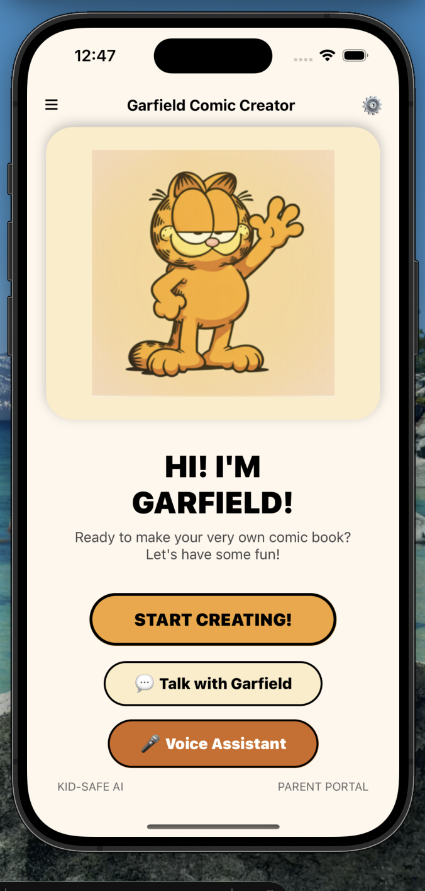
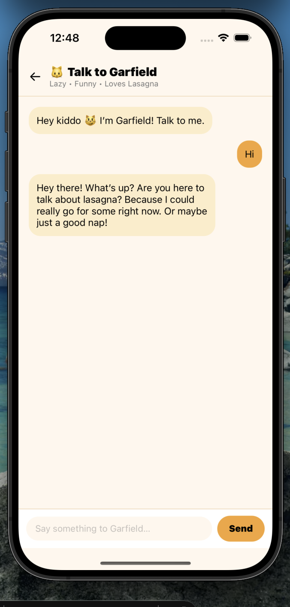
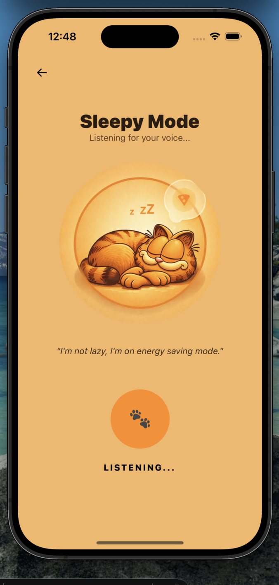

# 🧒📚 Garfield Kids Comic App

An AI-powered React Native comic storytelling app that generates fun, interactive comic stories for kids using voice, text, and AI.

Built with ❤️ using React Native (Expo) + Backend API integration.

## 📸 App Preview

  
  
  

---

## 🚀 Features

✨ AI Comic Story Generator  
🧠 Garfield AI Character Interaction  
📖 Custom Story Maker  
🌐 Backend API Integration  
📱 iOS Simulator & Expo Compatible  

---

## 🛠 Tech Stack

### Frontend
- React Native (Expo)
- TypeScript
- Expo Router
- Async Storage
- Expo AV (Audio)
- Axios (API calls)

### Backend
- Node.js (if applicable)
- Express.js
- REST APIs
- AI Integration

### Tools
- Git & GitHub
- npm
- Expo CLI
- iOS Simulator

---

## 📂 Project Structure
